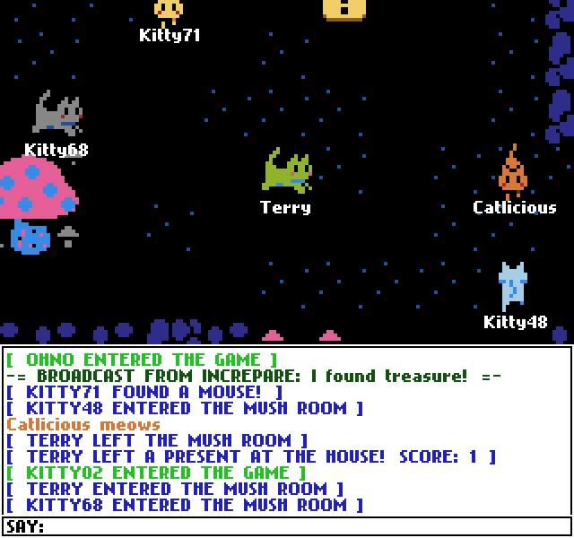

# Chatchat Javascript Port

This is my HTML5 port of ChatChat! [Original Flash version's source code can be found here](https://github.com/TerryCavanagh/chatchat)

This is now the "official" live version, [which you can play on Kongregate!](http://www.kongregate.com/games/TerryCavanagh_B/chatchat)

## Status

This port is complete! I believe it has all the features of the original ChatChat now, plus some extras:

* Sligntly improved keyboard controls
* Touchscreen controls
* Room passwords
* Up to 64 players per room!

## Developing

#### Setup

[Requires Node 14+](https://nodejs.org/en/)

In the project directory, install local dependencies:

* `npm install`

And some additional global dependencies for development

* `npm install --global concurrently nodemon live-server`

#### Running

`npm run dev`

Now you can edit the files in the src directory and your server and browser will automatically update.
